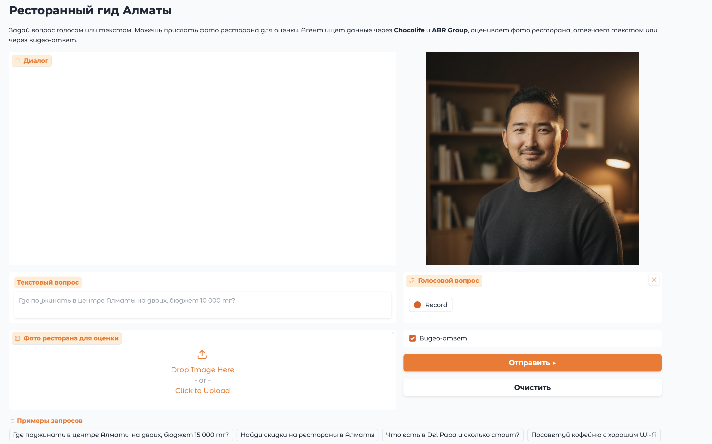

# AI Avatar Agent — Multimodal Restaurant Guide for Almaty

A personal AI assistant for Almaty restaurants with a talking avatar. Accepts text, voice, and image input. Responds with text and video featuring a cloned voice avatar.

## Architecture

```
            ┌──────────────────────────────────────────────────┐
            │                   USER INPUT                     │
            │          text  /  voice  /  photo                │
            └─────────────┬──────────────────────┬─────────────┘
                          │ voice                │ text / photo
                          v                      │
                  ┌───────────────┐              │
                  │ ASR (Whisper) │              │
                  │ speech → text │              │
                  └───────┬───────┘              │
                          └────────────┬─────────┘
                                       │
                                       v
            ┌──────────────────────────────────────────────────┐
            │                LLM GPT-4o-mini                   │
            │           Function Calling + Memory              │
            └───┬──────────────┬──────────────┬─────────────┬──┘
                │              │              │             │
                v              v              v             v
    ┌─────────────┐  ┌─────────────┐  ┌─────────────┐  ┌─────────────┐
    │   MCP #1    │  │   MCP #2    │  │   MCP #3    │  │Custom Skill │
    │    2GIS     │  │  Chocolife  │  │  ABR Group  │  │ analyze_    │
    │  search_    │  │  search_    │  │  get_rest_  │  │ restaurant_ │
    │ restaurants │  │   deals     │  │    info     │  │photo(vision)│
    └──────┬──────┘  └──────┬──────┘  └──────┬──────┘  └──────┬──────┘
           │                │                │                │
           └────────────────┴──────────┬─────┴────────────────┘
                                       │
                                       v
                          ┌────────────────────────┐
                          │      Text Response     │
                          └────────────┬───────────┘
                                       │
                        ┌──────────────┴──────────────┐
                        │                             │
                        v                             v
           ┌────────────────────────┐   ┌────────────────────────┐
           │  TTS (MiniMax          │   │  Avatar Video          │
           │  Speech-02-HD,         │   │  (Kling AI Avatar V2)  │
           │  cloned voice)         │   │  photo + audio → video │
           └────────────┬───────────┘   └────────────┬───────────┘
                        │                            │
                        └──────────────┬─────────────┘
                                       │
                                       v
                          ┌────────────────────────┐
                          │       Gradio UI        │
                          │  text + audio + video  │
                          └────────────────────────┘
```

## Components

| Component | Technology |
|-----------|-----------|
| ASR | OpenAI Whisper-1 |
| LLM Brain | GPT-4o-mini (tool calling + vision) |
| MCP #1 | 2GIS — restaurant search in Almaty |
| MCP #2 | Chocolife — deals and discounts |
| MCP #3 | ABR Group — detailed restaurant info |
| Custom Skill | Restaurant critic (analyze_restaurant_photo) |
| TTS | fal.ai MiniMax Speech-02-HD |
| Voice Clone | fal.ai MiniMax Voice Clone |
| Avatar Video | fal.ai Kling AI Avatar V2 |
| Frontend | Gradio |

## Model Choices

| Component | Model | Why |
|-----------|-------|-----|
| LLM | GPT-4o-mini | Cheapest model with both vision and tool calling support — no need to pay for GPT-4o |
| ASR | OpenAI Whisper-1 | Native OpenAI integration, same API key, reliable Russian transcription |
| TTS | MiniMax Speech-02-HD | Best quality cloned-voice TTS available on fal.ai at reasonable cost |
| Voice Clone | MiniMax Voice Clone | 10-second sample is enough, $0.50 one-time cost, integrates directly with Speech-02-HD |
| Avatar Video | Kling Avatar V2 | More affordable alternative to Creatify Aurora with multi-style support; sufficient quality for the project budget |

## Quick Start

### 1. Clone and install dependencies

```bash
git clone <repo>
cd video-ai
python -m venv venv
source venv/bin/activate        # Windows: venv\Scripts\activate
pip install -r requirements.txt
python -m playwright install chromium
```

### 2. Configure environment variables

```bash
cp .env.example .env
```

Fill in `.env`:
```
OPENAI_API_KEY=sk-...
FAL_KEY=...
MINIMAX_VOICE_ID=your_voice_id    # see step 3
AVATAR_PHOTO_PATH=avatar/my_photo.jpg
VOICE_SAMPLE_PATH=voice/my_voice_sample.wav
```

### 3. Prepare voice and photo

**Voice** — if you don't have a voice_id yet:
1. Record an audio sample of your voice (at least 10 seconds, clean sound)
2. Save it as `voice/my_voice_sample.wav`
3. Run cloning:
   ```bash
   python voice/clone.py
   ```
4. Copy the resulting `voice_id` into `.env` as `MINIMAX_VOICE_ID`

**Photo** — save a frontal portrait (at least 512x512, neutral background) as `avatar/my_photo.jpg`

### 4. Run the application

```bash
python app.py
```

Open in browser: http://localhost:7860

## Project Structure

```
video-ai/
├── app.py                    # Gradio UI (entry point)
├── config.py                 # Model and parameter configuration
├── requirements.txt
├── .env.example
├── agent/
│   ├── llm.py               # LLM + MCP client + agentic loop
│   ├── tools.py             # Tool schemas + restaurant critic skill
│   └── pipeline.py          # Orchestrator: ASR -> LLM -> TTS -> Avatar
├── mcp_servers/
│   ├── twogis/
│   │   ├── server.py        # MCP #1: 2GIS (restaurant search)
│   │   └── README.md
│   ├── chocolife/
│   │   ├── server.py        # MCP #2: Chocolife (deals and discounts)
│   │   └── README.md
│   └── abr_group/
│       ├── server.py        # MCP #3: ABR Group (restaurant info)
│       └── README.md
├── voice/
│   ├── clone.py             # Voice cloning script
│   ├── tts.py               # TTS generation
│   └── my_voice_sample.wav  # (add your own)
├── avatar/
│   ├── generate.py          # Video generation via Kling Avatar V2
│   └── my_photo.jpg         # (add your own)
└── assets/
    └── demo.mp4             # (video recording is svaed separately, only screen is atatched)
```

## Interface



## Example Queries

- "Where to have dinner in central Almaty for two, budget 15,000 tenge?"
- "Find restaurant discounts in Almaty"
- "What does Del Papa have and how much does it cost?"
- *(send a restaurant photo)* -> the agent will determine the establishment level

## Cost Optimization

- **Model routing**: GPT-4o-mini for everything (vision + text) — cheaper than GPT-4o
- **Caching**: Chocolife results cached for 5 min, ABR Group for 10 min
- **`detail: "low"`** for all vision calls — saves tokens
- **Video on demand** — the "Video response" checkbox is off by default
- Responses limited to 600 chars -> short audio -> short video

## Approximate Budget

| Service | Cost |
|---------|------|
| fal.ai (Kling Avatar V2) | ~$0.05-0.10 per video |
| fal.ai (MiniMax TTS) | ~$0.03-0.05 per response |
| fal.ai (Voice Clone) | ~$0.50 (one-time) |
| OpenAI (GPT-4o-mini + Whisper) | ~$0.01-0.02 per request |
| **Total for project** | **~$5-15** |

## What Could Be Improved

- Add multi-language support (currently Russian only)
- Implement streaming LLM responses for faster perceived latency
- Add a local cache layer (SQLite/Redis) instead of in-memory dicts for MCP results
- Support more restaurant data sources beyond Almaty
- Add user authentication and personalized recommendation history
